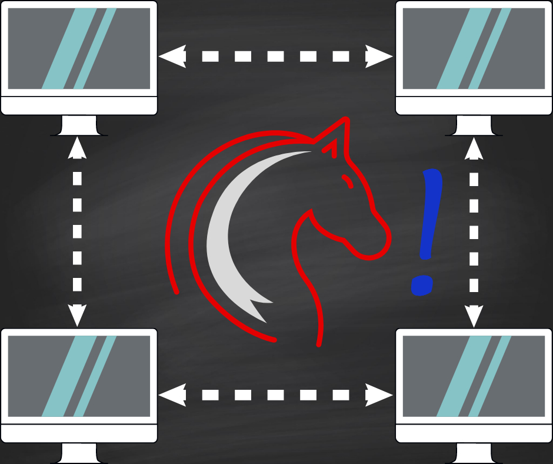
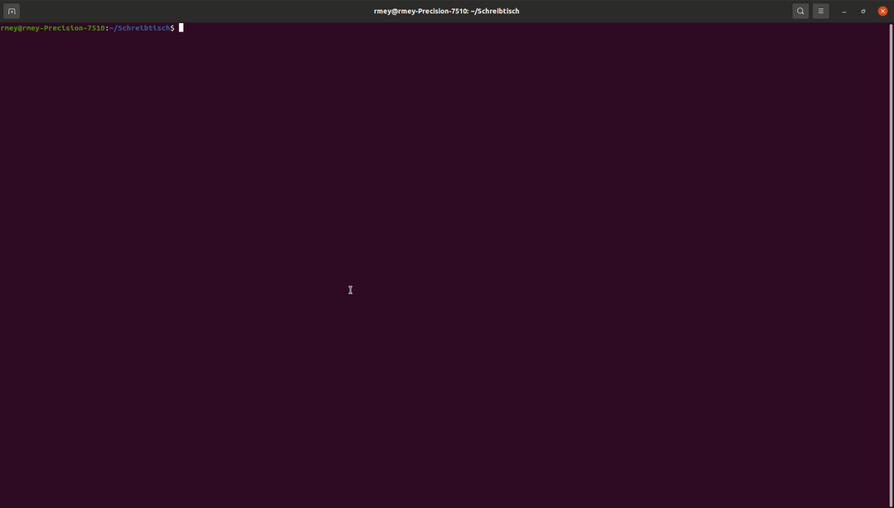

<p align="center">
  <a href="https://github.com/Richl-lab/recognize-unusual-logins/">
    
  </a>

  <h3 align="center">FindMaliciousEvents</h3>

  <p align="center">
    This tool is used to find anomalies or suspicious login events, especially to detect lateral movement.
    <br />
    <a href="https://github.com/Richl-lab/recognize-unusual-logins/blob/main/README.md"><strong>Explore the docs »</strong></a>
    <br />
    <br />
    <a href="https://github.com/Richl-lab/recognize-unusual-logins#demo">View Demo</a>
    ·
    <a href="https://github.com/Richl-lab/recognize-unusual-logins/issues">Report Bug</a>
    ·
    <a href="https://github.com/Richl-lab/recognize-unusual-logins/tree/main/maintenance">See docs to add Features</a>
  </p>

- [About The Project](#about-the-project)
  * [Built With](#built-with)
- [Getting Started](#getting-started)
  * [Prerequisites & Installation](#prerequisites---installation)
- [Logon Data](#logon-data)
- [Usage](#usage)
  * [Examples](#examples)
  * [Demo](#demo)
- [Roadmap](#roadmap)
- [License](#license)
- [Contact](#contact)
- [Acknowledgements](#acknowledgements)

## About The Project
This tool is used to find anomalies or suspicious login events.

### Built With
* R & R-Studio
* Python & Jupyter Notebook/Pycharm
* Shell Pycharm

## Getting Started

### Prerequisites & Installation
This tool will only work in Linux (tested with Ubuntu 20.04).
To use the tool, R and Python 3.8 needs to be installed. Furthermore, is a requirement an existing python environment in the folder with conditions of the requirements.txt.

To install and configure, use the following script:
   ```sh
   . setup.sh
   ```
Installs:
* r-base
* python 3.8
* pip
* python3-venv
* wheel and some more python packages (requirments.txt)
* r-packages (dplyr,...)

Configuration:
* virtual environment named maliciousevents
* create ~/.R directory for r site-packages

Optional Configuration:

Add a link to one of your $PATH locations. As example, it can look like:
   ```sh
ln -s -r FindMaliciousEvents.R ~/.local/bin/FindMaliciousEvents   
  ```


## Logon Data
The data needs the following structure:
| Event ID        | Host           | Time  | Logon ID        | User           | Source  | Source Port           | Logon Type  |
| ------------- |:-------------:| :-----:| :------------- |:-------------:| :-----:|:-------------:| -----:|
| Integer      | Numeric | Date | Numeric(hex)     | Numeric | Numeric | Integer| Integer |
| 4624     | 1112223      | "2021-06-01 00:00:02" | 0x233eef      | 33339993 | 3333888 | 0 | 2 |

(Default) Users with smaller numbers than 10000 will be removed, because they are interpreted as Well-Known-SIDs. The Software was tested with anonymized Users, Hosts and Sources, so there is no guarantee that it works without that.

## Usage
After usage, the r-script should be executable.

With set link:
   ```sh
   FindMaliciousEvents args
   ```
Without:
   ```sh
   FindMaliciousEvents.R args
   or
   Rscript FindMaliciousEvents.R args
   ```

Arguments:
   ```sh
   FindMaliciousEvents [File location] [Directory to save] [Options]
   ```
For more information and options see:
   ```sh
   FindMaliciousEvents --help
   ```
### Examples
Find unusual logins from 2021-06-01 to 2021-07-01:
   ```sh
   FindMaliciousEvents raw_data.csv . -d m 2021-06-01 2021-07-01
   ```
Find unusual logins with the use of kNN and rank it:
   ```sh
   FindMaliciousEvents raw_data.csv . -m kNN -r
   ```
Find unusual logins from a existing feature set, that was created with this software:
   ```sh
   FindMaliciousEvents features.csv . -e
   ```

### Demo

   
## Maintenance
If you want to add new features, see [Maintenance Directory](https://github.com/Richl-lab/recognize-unusual-logins/tree/main/maintenance). It contains a description to add different kind of features. 


## Roadmap


## License
Distributed under the MIT License. See [LICENSE](https://github.com/Richl-lab/recognize-unusual-logins/blob/main/LICENSE) for more information.

## Contact
Richard Mey
* Private:richard.meissen@gmail.com
* University:rmey@hs-mittweida.de
* Company:richard.mey@syss.de

Project Link/Location:

[Github Repository](https://github.com/Richl-lab/recognize-unusual-logins#acknowledgements)

## Acknowledgements
* [README Template](https://github.com/othneildrew/Best-README-Template/blob/master/README.md)
* [Pyod kNN](https://pyod.readthedocs.io/en/latest/pyod.models.html?highlight=knn#pyod.models.knn.KNN)
* [Scikit Isolationforest](https://scikit-learn.org/stable/modules/generated/sklearn.ensemble.IsolationForest.html)
* [DAGMM](https://github.com/tnakae/DAGMM)


